# DESENVOLVIMENTO - Hackthon

## CATEGORIA DO PROJETO

**Tipo:** Jogo Educacional / EdTech
**Domínio:** Educação Financeira
**Modelo:** Gamificação estilo Duolingo
**Plataforma:** Web (escopo inicial)

---

## CLASSES E ESTRUTURAS (Go)

### 1. Usuário (User)
```go
type User struct {
    ID          string    `json:"id"`
    Username    string    `json:"username"`
    Email       string    `json:"email"`
    XP          int       `json:"xp"`
    Level       int       `json:"level"`
    CreatedAt   time.Time `json:"created_at"`
    UpdatedAt   time.Time `json:"updated_at"`
    Progress    UserProgress `json:"progress"`
}
```

### 2. Progresso do Usuário (UserProgress)
```go
type UserProgress struct {
    UserID              string            `json:"user_id"`
    CompletedLevels     []string          `json:"completed_levels"`
    CurrentLevel        string            `json:"current_level"`
    CompletedMissions   []string          `json:"completed_missions"`
    Achievements        []Achievement     `json:"achievements"`
    LastActivity        time.Time         `json:"last_activity"`
}
```

### 3. Pergunta (Question)
```go
type Question struct {
    ID          string    `json:"id"`
    Difficulty  string    `json:"difficulty"`  // iniciante, basico, medio, avancado
    Subject     string    `json:"subject"`     // introducao, credito, investimentos, financiamento
    Context     string    `json:"context"`
    Question    string    `json:"question"`
    Options     []string  `json:"options"`
    CorrectAnswer int     `json:"correct_answer"`
    Explanation string    `json:"explanation"`
    XPValue     int       `json:"xp_value"`
    CreatedAt   time.Time `json:"created_at"`
}
```

### 4. Resposta do Usuário (UserAnswer)
```go
type UserAnswer struct {
    ID          string    `json:"id"`
    UserID      string    `json:"user_id"`
    QuestionID  string    `json:"question_id"`
    Answer      int       `json:"answer"`
    IsCorrect   bool      `json:"is_correct"`
    TimeSpent   int       `json:"time_spent"`  // em segundos
    AnsweredAt  time.Time `json:"answered_at"`
}
```

### 5. Missão (Mission)
```go
type Mission struct {
    ID          string    `json:"id"`
    Title       string    `json:"title"`
    Description string    `json:"description"`
    Type        string    `json:"type"`        // daily, weekly, achievement
    XP Reward   int       `json:"xp_reward"`
    Requirements map[string]interface{} `json:"requirements"`
    ExpiresAt   *time.Time `json:"expires_at,omitempty"`
}
```

### 6. Nível (Level)
```go
type Level struct {
    ID          string    `json:"id"`
    Number      int       `json:"number"`
    Name        string    `json:"name"`
    Difficulty  string    `json:"difficulty"`
    Subject     string    `json:"subject"`
    Questions   []string  `json:"question_ids"`
    RequiredXP  int       `json:"required_xp"`
    Unlocked    bool      `json:"unlocked"`
}
```

### 7. Conquista (Achievement)
```go
type Achievement struct {
    ID          string    `json:"id"`
    Title       string    `json:"title"`
    Description string    `json:"description"`
    Icon        string    `json:"icon"`
    XP Reward   int       `json:"xp_reward"`
    UnlockedAt  *time.Time `json:"unlocked_at,omitempty"`
}
```

---

## PARÂMETROS DO SISTEMA

### Configurações de XP
- **XP por resposta correta:** 10 pontos
- **XP por nível completado:** 50 pontos
- **XP por missão diária:** 25 pontos
- **XP por conquista:** 100 pontos

### Níveis de Dificuldade
- **Iniciante:** 0-100 XP
- **Básico:** 101-300 XP
- **Médio:** 301-600 XP
- **Avançado:** 601+ XP

### Matérias Disponíveis
- Introdução à Educação Financeira
- Crédito
- Investimentos
- Financiamento

---

## ROADMAP - ESCOPO INICIAL

### Fase 1: Setup e Infraestrutura-
- [ ] Configuração do repositório GitHub
- [ ] Setup do projeto Go
- [ ] Configuração do PostgreSQL
- [ ] Estrutura de pastas do projeto
- [ ] Configuração de variáveis de ambiente

### Fase 2: Modelos e Banco de Dados-
- [ ] Criação das tabelas no PostgreSQL
- [ ] Implementação das structs Go
- [ ] Migrations do banco de dados
- [ ] Seed de dados iniciais (perguntas)

### Fase 3: API REST-
- [ ] Endpoints de usuário (CRUD)
- [ ] Endpoints de perguntas
- [ ] Endpoints de respostas
- [ ] Endpoints de progresso
- [ ] Endpoints de missões
- [ ] Middleware de autenticação
- [ ] Validação de dados

### Fase 4: Lógica de Negócio-
- [ ] Sistema de XP e níveis
- [ ] Lógica de desbloqueio de níveis
- [ ] Sistema de missões
- [ ] Sistema de conquistas
- [ ] Cálculo de progresso

### Fase 5: Deploy e Testes-
- [ ] Configuração no Render
- [ ] Testes unitários
- [ ] Testes de integração
- [ ] Documentação da API
- [ ] Deploy em produção

---

## DADOS EM JSON

### Estrutura de Perguntas (questions.json)
```json
{
  "questions": [
    {
      "id": "q001",
      "difficulty": "iniciante",
      "subject": "introducao",
      "context": "Você está começando a aprender sobre educação financeira e precisa entender os conceitos básicos.",
      "question": "O que é uma reserva de emergência?",
      "options": [
        "Dinheiro guardado para compras supérfluas",
        "Valor reservado para imprevistos e situações de urgência",
        "Investimento de alto risco",
        "Conta corrente comum"
      ],
      "correct_answer": 1,
      "explanation": "A reserva de emergência é um valor guardado especificamente para cobrir gastos inesperados, como desemprego, doenças ou reparos urgentes.",
      "xp_value": 10
    },
    {
      "id": "q002",
      "difficulty": "basico",
      "subject": "credito",
      "context": "Você está aprendendo sobre como usar o crédito de forma consciente.",
      "question": "Qual é a melhor prática ao usar cartão de crédito?",
      "options": [
        "Usar todo o limite disponível",
        "Pagar apenas o valor mínimo",
        "Pagar a fatura integralmente antes do vencimento",
        "Não verificar a fatura mensalmente"
      ],
      "correct_answer": 2,
      "explanation": "Pagar a fatura integralmente antes do vencimento evita juros e mantém um bom histórico de crédito.",
      "xp_value": 15
    },
    {
      "id": "q003",
      "difficulty": "medio",
      "subject": "investimentos",
      "context": "Você está explorando opções de investimento para fazer seu dinheiro render.",
      "question": "Qual é a principal diferença entre renda fixa e renda variável?",
      "options": [
        "Não há diferença",
        "Renda fixa tem retorno previsível, renda variável não",
        "Renda variável é sempre mais segura",
        "Renda fixa não existe no Brasil"
      ],
      "correct_answer": 1,
      "explanation": "Renda fixa oferece retorno previsível e menor risco, enquanto renda variável tem retorno incerto e maior risco.",
      "xp_value": 20
    },
    {
      "id": "q004",
      "difficulty": "avancado",
      "subject": "financiamento",
      "context": "Você está analisando opções de financiamento imobiliário.",
      "question": "O que significa CET (Custo Efetivo Total) em um financiamento?",
      "options": [
        "Apenas a taxa de juros",
        "O valor total do imóvel",
        "Todos os custos envolvidos no financiamento expressos em taxa anual",
        "A entrada do financiamento"
      ],
      "correct_answer": 2,
      "explanation": "O CET inclui todos os custos do financiamento: juros, taxas, seguros e encargos, expressos em uma taxa anual.",
      "xp_value": 25
    }
  ]
}
```

### Estrutura de Níveis (levels.json)
```json
{
  "levels": [
    {
      "id": "level_001",
      "number": 1,
      "name": "Primeiros Passos",
      "difficulty": "iniciante",
      "subject": "introducao",
      "question_ids": ["q001", "q002", "q003"],
      "required_xp": 0,
      "unlocked": true
    },
    {
      "id": "level_002",
      "number": 2,
      "name": "Entendendo Crédito",
      "difficulty": "basico",
      "subject": "credito",
      "question_ids": ["q004", "q005", "q006"],
      "required_xp": 50,
      "unlocked": false
    },
    {
      "id": "level_003",
      "number": 3,
      "name": "Investindo com Sabedoria",
      "difficulty": "medio",
      "subject": "investimentos",
      "question_ids": ["q007", "q008", "q009"],
      "required_xp": 150,
      "unlocked": false
    },
    {
      "id": "level_004",
      "number": 4,
      "name": "Financiamentos Avançados",
      "difficulty": "avancado",
      "subject": "financiamento",
      "question_ids": ["q010", "q011", "q012"],
      "required_xp": 300,
      "unlocked": false
    }
  ]
}
```

### Estrutura de Missões (missions.json)
```json
{
  "missions": [
    {
      "id": "mission_001",
      "title": "Primeiro Dia",
      "description": "Complete 5 perguntas hoje",
      "type": "daily",
      "xp_reward": 25,
      "requirements": {
        "questions_answered": 5,
        "time_period": "day"
      },
      "expires_at": null
    },
    {
      "id": "mission_002",
      "title": "Estudante Dedicado",
      "description": "Complete 3 níveis consecutivos",
      "type": "achievement",
      "xp_reward": 100,
      "requirements": {
        "levels_completed": 3,
        "consecutive": true
      },
      "expires_at": null
    },
    {
      "id": "mission_003",
      "title": "Semana Produtiva",
      "description": "Responda 20 perguntas esta semana",
      "type": "weekly",
      "xp_reward": 50,
      "requirements": {
        "questions_answered": 20,
        "time_period": "week"
      },
      "expires_at": null
    }
  ]
}
```

### Estrutura de Conquistas (achievements.json)
```json
{
  "achievements": [
    {
      "id": "ach_001",
      "title": "Iniciante",
      "description": "Complete seu primeiro nível",
      "icon": "🎯",
      "xp_reward": 50,
      "unlocked_at": null
    },
    {
      "id": "ach_002",
      "title": "Estudante Aplicado",
      "description": "Responda 50 perguntas corretamente",
      "icon": "📚",
      "xp_reward": 100,
      "unlocked_at": null
    },
    {
      "id": "ach_003",
      "title": "Mestre Financeiro",
      "description": "Alcance 1000 XP",
      "icon": "🏆",
      "xp_reward": 200,
      "unlocked_at": null
    }
  ]
}
```

---

## MAPAS MENTAIS

### Mapa Mental 1: Arquitetura do Sistema
```
                    HACKTHON - Educação Financeira
                            |
        +-------------------+-------------------+
        |                   |                   |
    FRONTEND            BACKEND (Go)        DATABASE
        |                   |                   |
    React/Flutter      API REST            PostgreSQL
        |                   |                   |
        |           +-------+-------+           |
        |           |       |       |           |
        |      Handlers  Models  Services      |
        |           |       |       |           |
        |           +-------+-------+           |
        |                                       |
        +-------------------+-------------------+
                            |
                    DEPLOY (Render)
```

### Mapa Mental 2: Fluxo de Dados
```
    Usuário
        |
        v
    Frontend (React/Flutter)
        |
        v
    API REST (Go)
        |
        +---> Autenticação
        |
        +---> Validação
        |
        v
    Services Layer
        |
        +---> UserService
        +---> QuestionService
        +---> ProgressService
        +---> MissionService
        |
        v
    Database Layer (PostgreSQL)
        |
        +---> Users Table
        +---> Questions Table
        +---> Answers Table
        +---> Progress Table
        +---> Missions Table
```

### Mapa Mental 3: Estrutura de Níveis e Progressão
```
                    SISTEMA DE NÍVEIS
                            |
        +-------------------+-------------------+
        |                   |                   |
    DIFICULDADE         MATÉRIA            PROGRESSÃO
        |                   |                   |
    +---+---+---+       +---+---+---+       +---+---+
    |   |   |   |       |   |   |   |       |   |   |
    I   B   M   A       I   C   Inv Fin     XP  Level
    n   a   é   v       n   r               |   |
    i   s   d   a       t   e               |   +---+
    c   i   i   n       r   d               |       |
    i   c   o   ç       o   i               |   Missões
    a   o       a       d   t               |   |
    d           d       u   o               |   Conquistas
    o                   ç   s               |
                        ã                     |
                                            |
                                    Sistema de Recompensas
```

### Mapa Mental 4: Funcionalidades Principais
```
                    FUNCIONALIDADES
                            |
        +-------------------+-------------------+
        |                   |                   |
    GAMIFICAÇÃO        CONTEÚDO           PROGRESSO
        |                   |                   |
    +---+---+---+       +---+---+---+       +---+---+
    |   |   |   |       |   |   |   |       |   |   |
    XP  Missões Conquistas Perguntas Níveis Mapa Histórico
    |   |   |           |   |           |   |
    |   |   |           |   |           |   +---+
    |   |   |           |   |           |       |
    |   |   |           |   |           |   Estatísticas
    |   |   |           |   |           |
    |   |   |           |   |           |
    |   |   |           |   +---+
    |   |   |           |       |
    |   |   |           |   Dificuldade
    |   |   |           |
    |   |   |           +---+
    |   |   |               |
    |   |   |           Matéria
    |   |   |
    |   |   +---+
    |   |       |
    |   |   Badges
    |   |
    |   +---+
    |       |
    |   Ranking
    |
    +---+
        |
    Níveis
```

### Mapa Mental 5: Tecnologias e Ferramentas
```
                    STACK TECNOLÓGICO
                            |
        +-------------------+-------------------+
        |                   |                   |
    FRONTEND            BACKEND            INFRAESTRUTURA
        |                   |                   |
    React/Flutter       Go (Golang)         PostgreSQL
        |                   |                   |
    HTML/CSS/JS        Gin/Echo            Docker
        |                   |                   |
    Figma (Design)     JWT Auth            Render (Deploy)
        |                   |                   |
                        JSON API            GitHub (Repo)
                                            |
                                    GitHub Actions (CI/CD)
```

---

## DIAGRAMAS DE TAREFAS E FLUXOS DE COMUNICAÇÃO

Esta seção contém diagramas detalhados de como as diferentes partes do sistema se comunicam e executam tarefas no escopo inicial.

---

### Diagrama 1: Fluxo de Autenticação e Login

**Descrição:** Processo completo de autenticação do usuário no sistema.

```mermaid
sequenceDiagram
    participant U as Usuário
    participant F as Frontend
    participant A as API Handler
    participant Auth as AuthService
    participant DB as PostgreSQL

    U->>F: Preenche credenciais (email/senha)
    F->>A: POST /api/auth/login
    A->>Auth: ValidateCredentials(email, password)
    Auth->>DB: SELECT user WHERE email = ?
    DB-->>Auth: User data
    Auth->>Auth: Verifica senha (bcrypt)
    alt Credenciais válidas
        Auth->>Auth: Gera JWT Token
        Auth-->>A: Token + User data
        A-->>F: 200 OK {token, user}
        F->>F: Armazena token (localStorage)
        F-->>U: Redireciona para Dashboard
    else Credenciais inválidas
        Auth-->>A: Error: Invalid credentials
        A-->>F: 401 Unauthorized
        F-->>U: Exibe mensagem de erro
    end
```



**Fluxo ASCII:**
```
┌─────────┐     ┌──────────┐     ┌─────────────┐     ┌──────────────┐     ┌──────────┐
│ Usuário │────>│ Frontend │────>│ API Handler│────>│ AuthService  │────>│PostgreSQL│
└─────────┘     └──────────┘     └─────────────┘     └──────────────┘     └──────────┘
     │                │                  │                    │                  │
     │  1. Login      │                  │                    │                  │
     │───────────────>│                  │                    │                  │
     │                │  2. POST /auth   │                    │                  │
     │                │──────────────────>│                    │                  │
     │                │                  │  3. Validate        │                  │
     │                │                  │────────────────────>│                  │
     │                │                  │                    │  4. Query User    │
     │                │                  │                    │──────────────────>│
     │                │                  │                    │<──────────────────│
     │                │                  │                    │  5. Verify Pass   │
     │                │                  │                    │  6. Generate JWT  │
     │                │                  │<────────────────────│                  │
     │                │<──────────────────│                    │                  │
     │<───────────────│                  │                    │                  │
     │  7. Dashboard  │                  │                    │                  │
```

---

### Diagrama 2: Fluxo de Responder Pergunta

**Descrição:** Processo completo desde a solicitação de uma pergunta até o registro da resposta e atualização de XP.

```mermaid
sequenceDiagram
    participant U as Usuário
    participant F as Frontend
    participant A as API Handler
    participant QS as QuestionService
    participant PS as ProgressService
    participant DB as PostgreSQL

    U->>F: Seleciona nível para estudar
    F->>A: GET /api/levels/{levelId}/question
    A->>QS: GetQuestionByLevel(levelId)
    QS->>DB: SELECT question WHERE level_id = ? ORDER BY RANDOM() LIMIT 1
    DB-->>QS: Question data
    QS-->>A: Question JSON
    A-->>F: 200 OK {question}
    F-->>U: Exibe pergunta e opções
    
    U->>F: Seleciona resposta
    F->>A: POST /api/questions/{questionId}/answer
    Note over F,A: {user_id, answer, time_spent}
    A->>QS: ValidateAnswer(questionId, answer)
    QS->>DB: SELECT question WHERE id = ?
    DB-->>QS: Correct answer
    QS->>QS: Compara respostas
    QS-->>A: {is_correct, explanation, xp_value}
    
    alt Resposta correta
        A->>PS: UpdateUserXP(userId, xpValue)
        PS->>DB: UPDATE users SET xp = xp + ? WHERE id = ?
        PS->>PS: CheckLevelUp(userId)
        PS->>DB: SELECT level WHERE required_xp <= ? ORDER BY required_xp DESC LIMIT 1
        DB-->>PS: New level
        PS->>DB: UPDATE users SET level = ? WHERE id = ?
        PS->>PS: CheckMissionProgress(userId)
        PS-->>A: {new_xp, new_level, missions_completed}
    else Resposta incorreta
        PS-->>A: {xp: 0}
    end
    
    A->>DB: INSERT INTO user_answers (user_id, question_id, answer, is_correct, time_spent)
    A-->>F: 200 OK {is_correct, explanation, xp_gained, new_level}
    F-->>U: Exibe resultado e explicação
```



**Fluxo ASCII:**
```
┌─────────┐  ┌──────────┐  ┌─────────────┐  ┌──────────────┐  ┌──────────────┐  ┌──────────┐
│ Usuário │  │ Frontend │  │ API Handler │  │QuestionService│  │ProgressService│ │PostgreSQL│
└─────────┘  └──────────┘  └─────────────┘  └──────────────┘  └──────────────┘  └──────────┘
     │             │              │                 │                  │               │
     │ 1. Seleciona│              │                 │                  │               │
     │    Nível    │              │                 │                  │               │
     │────────────>│              │                 │                  │               │
     │             │ 2. GET /levels│                 │                  │               │
     │             │    /{id}/quest│                 │                  │               │
     │             │──────────────>│                 │                  │               │
     │             │              │ 3. GetQuestion   │                  │               │
     │             │              │─────────────────>│                  │               │
     │             │              │                 │ 4. Query DB      │               │
     │             │              │                 │──────────────────────────────────>│
     │             │              │                 │<──────────────────────────────────│
     │             │              │<────────────────│                  │               │
     │             │<─────────────│                  │                  │               │
     │<────────────│              │                  │                  │               │
     │ 5. Exibe    │              │                  │                  │               │
     │    Pergunta │              │                  │                  │               │
     │             │              │                  │                  │               │
     │ 6. Responde │              │                  │                  │               │
     │────────────>│              │                  │                  │               │
     │             │ 7. POST      │                  │                  │               │
     │             │    /answer   │                  │                  │               │
     │             │──────────────>│                 │                  │               │
     │             │              │ 8. Validate      │                  │               │
     │             │              │─────────────────>│                  │               │
     │             │              │                 │ 9. Query DB      │               │
     │             │              │                 │──────────────────────────────────>│
     │             │              │                 │<──────────────────────────────────│
     │             │              │<────────────────│                  │               │
     │             │              │ 10. Update XP    │                  │               │
     │             │              │─────────────────────────────────────>│               │
     │             │              │                 │ 11. Update DB    │               │
     │             │              │                 │──────────────────────────────────>│
     │             │              │                 │ 12. Check Level  │               │
     │             │              │                 │──────────────────────────────────>│
     │             │              │                 │<──────────────────────────────────│
     │             │              │<─────────────────────────────────────│               │
     │             │<─────────────│                  │                  │               │
     │<────────────│              │                  │                  │               │
     │ 13. Resultado│              │                  │                  │               │
```

---

### Diagrama 3: Fluxo de Completar Nível

**Descrição:** Processo de conclusão de um nível, desbloqueio de novos níveis e verificação de conquistas.


**Fluxo ASCII:**
```
┌─────────┐  ┌──────────┐  ┌─────────────┐  ┌──────────────┐  ┌──────────────┐  ┌──────────────┐  ┌──────────┐
│ Usuário │  │ Frontend │  │ API Handler │  │ProgressService│ │MissionService│ │AchievementSvc│ │PostgreSQL│
└─────────┘  └──────────┘  └─────────────┘  └──────────────┘  └──────────────┘  └──────────────┘  └──────────┘
     │             │              │                 │                  │                  │               │
     │ 1. Completa │              │                 │                  │                  │               │
     │    Nível    │              │                 │                  │                  │               │
     │────────────>│              │                 │                  │                  │               │
     │             │ 2. POST      │                 │                  │                  │               │
     │             │    /complete │                 │                  │                  │               │
     │             │──────────────>│                 │                  │                  │               │
     │             │              │ 3. CompleteLevel │                  │                  │               │
     │             │              │─────────────────>│                 │                  │               │
     │             │              │                 │ 4. Verifica      │                  │               │
     │             │              │                 │    perguntas     │                  │               │
     │             │              │                 │─────────────────────────────────────────────────────>│
     │             │              │                 │<─────────────────────────────────────────────────────│
     │             │              │                 │ 5. Marca completo│                  │               │
     │             │              │                 │─────────────────────────────────────────────────────>│
     │             │              │                 │ 6. Adiciona XP   │                  │               │
     │             │              │                 │─────────────────────────────────────────────────────>│
     │             │              │                 │ 7. Desbloqueia   │                  │               │
     │             │              │                 │    próximos      │                  │               │
     │             │              │                 │─────────────────────────────────────────────────────>│
     │             │              │                 │ 8. Verifica      │                  │               │
     │             │              │                 │    Missões       │                  │               │
     │             │              │                 │─────────────────────────────────────>│               │
     │             │              │                 │                 │ 9. Avalia        │               │
     │             │              │                 │                 │───────────────────────────────────>│
     │             │              │                 │                 │<───────────────────────────────────│
     │             │              │                 │ 10. Verifica    │                  │               │
     │             │              │                 │     Conquistas  │                  │               │
     │             │              │                 │─────────────────────────────────────────────────────>│
     │             │              │                 │                 │                  │ 11. Avalia     │
     │             │              │                 │                 │                  │────────────────>│
     │             │              │                 │                 │                  │<───────────────│
     │             │              │<────────────────│                 │                  │               │
     │             │<─────────────│                  │                  │                  │               │
     │<────────────│              │                  │                  │                  │               │
     │ 12. Celebra │              │                  │                  │                  │               │
```

---

### Diagrama 4: Fluxo de Verificação de Missões Diárias

**Descrição:** Processo de verificação e atualização de missões diárias do usuário.

```mermaid
sequenceDiagram
    participant U as Usuário
    participant F as Frontend
    participant A as API Handler
    participant MS as MissionService
    participant PS as ProgressService
    participant DB as PostgreSQL

    U->>F: Acessa dashboard
    F->>A: GET /api/users/{userId}/missions
    A->>MS: GetUserMissions(userId)
    MS->>DB: SELECT * FROM missions WHERE type IN ('daily', 'weekly')
    DB-->>MS: Available missions
    MS->>DB: SELECT completed_missions FROM user_progress WHERE user_id=?
    DB-->>MS: User completed missions
    MS->>MS: FilterActiveMissions(available, completed)
    MS->>MS: CheckMissionExpiration()
    MS->>DB: SELECT COUNT(*) FROM user_answers WHERE user_id=? AND answered_at >= CURRENT_DATE
    DB-->>MS: Questions answered today
    MS->>MS: EvaluateMissionProgress(userId, mission)
    MS-->>A: {active_missions, progress}
    A-->>F: 200 OK {missions}
    F-->>U: Exibe missões e progresso
    
    Note over U,DB: Usuário completa ação (ex: responde 5 perguntas)
    
    U->>F: Responde pergunta
    F->>A: POST /api/questions/{id}/answer
    A->>PS: UpdateUserXP(userId, xp)
    PS->>DB: UPDATE users SET xp = xp + ? WHERE id=?
    PS-->>A: Success
    A->>MS: CheckMissionProgress(userId)
    MS->>DB: SELECT * FROM missions WHERE type='daily' AND expires_at >= NOW()
    DB-->>MS: Daily missions
    MS->>DB: SELECT COUNT(*) FROM user_answers WHERE user_id=? AND answered_at >= CURRENT_DATE
    DB-->>MS: Current count
    MS->>MS: CheckMissionCompletion(userId, mission)
    
    alt Missão completada
        MS->>DB: UPDATE user_progress SET completed_missions = array_append(completed_missions, ?) WHERE user_id=?
        MS->>PS: AwardMissionXP(userId, mission.xp_reward)
        PS->>DB: UPDATE users SET xp = xp + ? WHERE id=?
        MS-->>A: {mission_completed, xp_reward}
        A-->>F: 200 OK {answer_result, mission_completed}
        F-->>U: Exibe resultado + notificação de missão
    else Missão não completada
        MS-->>A: {mission_progress}
        A-->>F: 200 OK {answer_result}
        F-->>U: Exibe resultado
    end
```



**Fluxo ASCII:**
```
┌─────────┐  ┌──────────┐  ┌─────────────┐  ┌──────────────┐  ┌──────────────┐  ┌──────────┐
│ Usuário │  │ Frontend │  │ API Handler │  │MissionService│  │ProgressService│ │PostgreSQL│
└─────────┘  └──────────┘  └─────────────┘  └──────────────┘  └──────────────┘  └──────────┘
     │             │              │                 │                  │               │
     │ 1. Acessa   │              │                 │                  │               │
     │    Dashboard│              │                 │                  │               │
     │────────────>│              │                 │                  │               │
     │             │ 2. GET       │                 │                  │               │
     │             │    /missions │                 │                  │               │
     │             │──────────────>│                 │                  │               │
     │             │              │ 3. GetMissions  │                  │               │
     │             │              │─────────────────>│                 │                  │               │
     │             │              │                 │ 4. Query DB     │               │
     │             │              │                 │───────────────────────────────────>│
     │             │              │                 │<───────────────────────────────────│
     │             │              │                 │ 5. Filtra       │                  │               │
     │             │              │                 │    ativas       │                  │               │
     │             │              │<────────────────│                  │                  │               │
     │             │<─────────────│                  │                  │                  │               │
     │<────────────│              │                  │                  │                  │               │
     │ 6. Vê       │              │                  │                  │                  │               │
     │    Missões  │              │                  │                  │                  │               │
     │             │              │                  │                  │                  │               │
     │ 7. Responde │              │                  │                  │                  │               │
     │    Pergunta │              │                  │                  │                  │               │
     │────────────>│              │                  │                  │                  │               │
     │             │ 8. POST      │                  │                  │                  │               │
     │             │    /answer   │                  │                  │                  │               │
     │             │──────────────>│                 │                  │                  │               │
     │             │              │ 9. Update XP    │                  │                  │               │
     │             │              │─────────────────────────────────────>│               │
     │             │              │                 │ 10. Verifica    │               │
     │             │              │                 │     Missões     │               │
     │             │              │                 │─────────────────>│               │
     │             │              │                 │ 11. Query DB   │               │
     │             │              │                 │───────────────────────────────────>│
     │             │              │                 │<───────────────────────────────────│
     │             │              │                 │ 12. Completa?   │               │
     │             │              │                 │───────────────────────────────────>│
     │             │              │                 │<───────────────────────────────────│
     │             │              │<────────────────│                  │                  │               │
     │             │<─────────────│                  │                  │                  │               │
     │<────────────│              │                  │                  │                  │               │
     │ 13. Notifica│              │                  │                  │                  │               │
```

---

### Diagrama 5: Arquitetura de Comunicação entre Componentes

**Descrição:** Visão geral de como os diferentes serviços e componentes se comunicam.

```mermaid
graph TB
    subgraph "Frontend Layer"
        UI[Interface do Usuário]
        State[Gerenciamento de Estado]
    end
    
    subgraph "API Layer"
        Router[Router/HTTP Handler]
        Middleware[Middleware Auth/Validation]
    end
    
    subgraph "Service Layer"
        UserSvc[UserService]
        QuestionSvc[QuestionService]
        ProgressSvc[ProgressService]
        MissionSvc[MissionService]
        AchievementSvc[AchievementService]
    end
    
    subgraph "Data Layer"
        UserRepo[UserRepository]
        QuestionRepo[QuestionRepository]
        ProgressRepo[ProgressRepository]
        MissionRepo[MissionRepository]
    end
    
    subgraph "Database"
        DB[(PostgreSQL)]
    end
    
    UI --> State
    State --> Router
    Router --> Middleware
    Middleware --> UserSvc
    Middleware --> QuestionSvc
    Middleware --> ProgressSvc
    Middleware --> MissionSvc
    
    UserSvc --> UserRepo
    QuestionSvc --> QuestionRepo
    ProgressSvc --> ProgressRepo
    ProgressSvc --> UserRepo
    MissionSvc --> MissionRepo
    MissionSvc --> ProgressRepo
    AchievementSvc --> ProgressRepo
    
    UserRepo --> DB
    QuestionRepo --> DB
    ProgressRepo --> DB
    MissionRepo --> DB
    
    ProgressSvc -.->|notifica| MissionSvc
    ProgressSvc -.->|notifica| AchievementSvc
    MissionSvc -.->|atualiza| ProgressSvc
```



**Arquitetura ASCII:**
```
┌─────────────────────────────────────────────────────────────────┐
│                        FRONTEND LAYER                            │
│  ┌──────────────┐         ┌──────────────────┐                 │
│  │      UI      │────────>│      State       │                 │
│  │  (React/HTML)│         │  (LocalStorage)  │                 │
│  └──────────────┘         └──────────────────┘                 │
└─────────────────────────────────────────────────────────────────┘
                              │
                              │ HTTP Requests
                              ▼
┌─────────────────────────────────────────────────────────────────┐
│                         API LAYER                               │
│  ┌──────────────────────────────────────────────────────────┐   │
│  │                    Router/Handler                        │   │
│  │  ┌──────────────┐  ┌──────────────┐  ┌──────────────┐  │   │
│  │  │   /auth      │  │  /questions  │  │   /progress  │  │   │
│  │  │   /users     │  │  /levels     │  │   /missions   │  │   │
│  │  └──────────────┘  └──────────────┘  └──────────────┘  │   │
│  └──────────────────────────────────────────────────────────┘   │
│  ┌──────────────────────────────────────────────────────────┐   │
│  │                    Middleware                             │   │
│  │  ┌──────────────┐  ┌──────────────┐  ┌──────────────┐  │   │
│  │  │   Auth       │  │  Validation  │  │   Logging    │  │   │
│  │  └──────────────┘  └──────────────┘  └──────────────┘  │   │
│  └──────────────────────────────────────────────────────────┘   │
└─────────────────────────────────────────────────────────────────┘
                              │
                              │ Service Calls
                              ▼
┌─────────────────────────────────────────────────────────────────┐
│                      SERVICE LAYER                               │
│  ┌──────────────┐  ┌──────────────┐  ┌──────────────┐         │
│  │ UserService  │  │QuestionService│ │ProgressService│         │
│  └──────────────┘  └──────────────┘  └──────────────┘         │
│  ┌──────────────┐  ┌──────────────┐                           │
│  │MissionService│  │AchievementSvc │                           │
│  └──────────────┘  └──────────────┘                           │
│                                                                 │
│  Comunicação entre serviços:                                    │
│  ProgressService ──notifica──> MissionService                   │
│  ProgressService ──notifica──> AchievementService               │
│  MissionService ──atualiza──> ProgressService                  │
└─────────────────────────────────────────────────────────────────┘
                              │
                              │ Repository Calls
                              ▼
┌─────────────────────────────────────────────────────────────────┐
│                       DATA LAYER                                 │
│  ┌──────────────┐  ┌──────────────┐  ┌──────────────┐         │
│  │ UserRepo     │  │QuestionRepo  │  │ProgressRepo  │         │
│  └──────────────┘  └──────────────┘  └──────────────┘         │
│  ┌──────────────┐                                               │
│  │MissionRepo   │                                               │
│  └──────────────┘                                               │
└─────────────────────────────────────────────────────────────────┘
                              │
                              │ SQL Queries
                              ▼
┌─────────────────────────────────────────────────────────────────┐
│                      DATABASE                                    │
│                    ┌──────────────┐                              │
│                    │  PostgreSQL  │                              │
│                    │              │                              │
│                    │  Tables:     │                              │
│                    │  - users     │                              │
│                    │  - questions │                              │
│                    │  - answers   │                              │
│                    │  - progress  │                              │
│                    │  - missions  │                              │
│                    │  - levels    │                              │
│                    └──────────────┘                              │
└─────────────────────────────────────────────────────────────────┘
```

---

### Diagrama 6: Fluxo de Cálculo de XP e Level Up

**Descrição:** Processo detalhado de cálculo de XP, verificação de level up e atualização de progresso.

```mermaid
flowchart TD
    Start([Usuário responde pergunta]) --> Check{Resposta<br/>correta?}
    Check -->|Não| NoXP[XP = 0]
    Check -->|Sim| GetXP[Obter XP da pergunta]
    GetXP --> AddXP[Adicionar XP ao usuário]
    AddXP --> UpdateDB1[UPDATE users SET xp = xp + ?]
    UpdateDB1 --> GetCurrentXP[SELECT xp FROM users WHERE id = ?]
    GetCurrentXP --> GetCurrentLevel[SELECT level FROM users WHERE id = ?]
    GetCurrentLevel --> CalculateLevel[Calcular nível baseado em XP]
    CalculateLevel --> Compare{Novo nível ><br/>nível atual?}
    Compare -->|Sim| LevelUp[Level Up!]
    LevelUp --> UpdateLevel[UPDATE users SET level = ? WHERE id = ?]
    UpdateLevel --> CheckMissions[Verificar missões relacionadas]
    CheckMissions --> CheckAchievements[Verificar conquistas]
    Compare -->|Não| CheckMissions
    NoXP --> SaveAnswer[Salvar resposta no DB]
    CheckAchievements --> SaveAnswer
    SaveAnswer --> UpdateProgress[Atualizar user_progress]
    UpdateProgress --> Return[Retornar resultado ao frontend]
    Return --> End([Fim])
    
    style LevelUp fill:#90EE90
    style Check fill:#FFE4B5
    style Compare fill:#FFE4B5
```



**Fluxo ASCII:**
```
                    ┌─────────────────────────┐
                    │ Usuário responde        │
                    │ pergunta                │
                    └───────────┬─────────────┘
                                │
                                ▼
                    ┌─────────────────────────┐
                    │ Resposta correta?       │
                    └───┬───────────────┬─────┘
                        │               │
                    Sim │               │ Não
                        │               │
                        ▼               ▼
        ┌───────────────────┐   ┌──────────────┐
        │ Obter XP da       │   │ XP = 0       │
        │ pergunta          │   └──────┬───────┘
        └─────────┬─────────┘          │
                  │                    │
                  ▼                    │
        ┌───────────────────┐          │
        │ Adicionar XP ao  │          │
        │ usuário          │          │
        └─────────┬─────────┘          │
                  │                    │
                  ▼                    │
        ┌───────────────────┐          │
        │ UPDATE users      │          │
        │ SET xp = xp + ?  │          │
        └─────────┬─────────┘          │
                  │                    │
                  ▼                    │
        ┌───────────────────┐          │
        │ SELECT xp, level  │          │
        │ FROM users        │          │
        └─────────┬─────────┘          │
                  │                    │
                  ▼                    │
        ┌───────────────────┐          │
        │ Calcular nível   │          │
        │ baseado em XP    │          │
        └───┬───────────────┘          │
            │                          │
            ▼                          │
    ┌───────────────┐                  │
    │ Novo nível >  │                  │
    │ nível atual?  │                  │
    └───┬───────┬───┘                  │
        │       │                      │
     Sim│       │Não                   │
        │       │                      │
        ▼       ▼                      ▼
┌───────────────┐  ┌──────────────┐  ┌──────────────┐
│ LEVEL UP!     │  │ Verificar    │  │ Salvar       │
│               │  │ missões       │  │ resposta     │
└───────┬───────┘  └──────┬───────┘  └──────┬───────┘
        │                 │                 │
        ▼                 ▼                 │
┌───────────────┐  ┌──────────────┐        │
│ UPDATE level  │  │ Verificar    │        │
│                │  │ conquistas  │        │
└───────┬───────┘  └──────┬───────┘        │
        │                 │                 │
        └─────────┬───────┴─────────────────┘
                  │
                  ▼
        ┌───────────────────┐
        │ Atualizar        │
        │ user_progress    │
        └─────────┬─────────┘
                  │
                  ▼
        ┌───────────────────┐
        │ Retornar resultado│
        │ ao frontend       │
        └─────────┬─────────┘
                  │
                  ▼
                [FIM]
```

---

### Diagrama 7: Fluxo de Desbloqueio de Níveis

**Descrição:** Processo de verificação e desbloqueio de novos níveis baseado no XP do usuário.

```mermaid
flowchart LR
    Start([Usuário ganha XP]) --> CheckXP{Verificar XP<br/>atual}
    CheckXP --> QueryLevels[SELECT * FROM levels<br/>WHERE required_xp <= user_xp<br/>AND unlocked = false]
    QueryLevels --> HasLevels{Existem níveis<br/>para desbloquear?}
    HasLevels -->|Não| End([Fim])
    HasLevels -->|Sim| Loop[Para cada nível]
    Loop --> CheckReq{required_xp <=<br/>user_xp?}
    CheckReq -->|Sim| Unlock[UPDATE levels<br/>SET unlocked = true]
    CheckReq -->|Não| Next[Próximo nível]
    Unlock --> UpdateProgress["UPDATE user_progress\nSET available_levels = array_append(available_levels, new_level_id)"]
    UpdateProgress --> Notify[Notificar frontend]
    Notify --> Next
    Next --> MoreLevels{Mais níveis?}
    MoreLevels -->|Sim| Loop
    MoreLevels -->|Não| End
    
    style Unlock fill:#90EE90
    style CheckXP fill:#FFE4B5
    style HasLevels fill:#FFE4B5
```



**Fluxo ASCII:**
```
┌─────────────────┐
│ Usuário ganha XP│
└────────┬─────────┘
         │
         ▼
┌─────────────────┐
│ Verificar XP    │
│ atual do usuário│
└────────┬─────────┘
         │
         ▼
┌─────────────────────────────────────────┐
│ SELECT * FROM levels                   │
│ WHERE required_xp <= user_xp           │
│ AND unlocked = false                   │
└────────┬────────────────────────────────┘
         │
         ▼
┌─────────────────┐
│ Existem níveis  │
│ para desbloquear│
└───┬─────────┬───┘
    │         │
 Sim│         │Não
    │         │
    ▼         ▼
┌─────────┐  ┌─────────┐
│ Loop    │  │  FIM    │
│ níveis  │  └─────────┘
└────┬────┘
     │
     ▼
┌─────────────────┐
│ required_xp <=  │
│ user_xp?        │
└───┬─────────┬───┘
    │         │
 Sim│         │Não
    │         │
    ▼         ▼
┌─────────┐  ┌─────────┐
│ DESBLOQ │  │ Próximo │
│ UEAR    │  │ nível   │
└────┬────┘  └────┬─────┘
     │           │
     ▼           │
┌─────────────────┐ │
│ UPDATE levels   │ │
│ SET unlocked=   │ │
│ true            │ │
└────┬────────────┘ │
     │               │
     ▼               │
┌─────────────────┐ │
│ UPDATE          │ │
│ user_progress   │ │
│ available_levels│ │
└────┬────────────┘ │
     │               │
     ▼               │
┌─────────────────┐ │
│ Notificar       │ │
│ frontend        │ │
└────┬────────────┘ │
     │               │
     └───────┬───────┘
             │
             ▼
     ┌───────────────┐
     │ Mais níveis?  │
     └───┬───────┬───┘
        Sim│     │Não
           │     │
           └─┬───┘
             │
             ▼
           [FIM]
```

---

### Diagrama 8: Fluxo Completo de Sessão de Estudo

**Descrição:** Fluxo completo desde o login até completar uma sessão de estudo.

```mermaid
stateDiagram-v2
    [*] --> Login: Usuário acessa app
    Login --> Authenticate: Submete credenciais
    Authenticate --> Dashboard: Autenticação OK
    Authenticate --> Login: Credenciais inválidas
    
    Dashboard --> SelectLevel: Usuário seleciona nível
    Dashboard --> ViewMissions: Usuário vê missões
    Dashboard --> ViewProgress: Usuário vê progresso
    
    SelectLevel --> CheckUnlock: Verifica se nível está desbloqueado
    CheckUnlock --> LoadQuestion: Nível desbloqueado
    CheckUnlock --> Dashboard: Nível bloqueado
    
    LoadQuestion --> DisplayQuestion: Carrega pergunta do DB
    DisplayQuestion --> UserAnswer: Usuário vê pergunta
    
    UserAnswer --> ValidateAnswer: Usuário seleciona resposta
    ValidateAnswer --> CheckCorrect: Valida resposta
    
    CheckCorrect --> UpdateXP: Resposta correta
    CheckCorrect --> ShowExplanation: Resposta incorreta
    
    UpdateXP --> CheckLevelUp: Adiciona XP
    CheckLevelUp --> LevelUp: XP suficiente para level up
    CheckLevelUp --> CheckMission: Sem level up
    
    LevelUp --> UpdateLevel: Atualiza nível
    UpdateLevel --> CheckAchievement: Verifica conquistas
    
    CheckMission --> CheckAchievement: Verifica missões
    CheckAchievement --> ShowResult: Mostra resultado
    
    ShowExplanation --> ShowResult: Mostra explicação
    ShowResult --> MoreQuestions: Pergunta respondida
    
    MoreQuestions --> LoadQuestion: Mais perguntas no nível
    MoreQuestions --> CheckLevelComplete: Última pergunta
    
    CheckLevelComplete --> CompleteLevel: Nível completo
    CheckLevelComplete --> LoadQuestion: Nível incompleto
    
    CompleteLevel --> UnlockNext: Desbloqueia próximo nível
    UnlockNext --> AwardRewards: Concede recompensas
    AwardRewards --> Dashboard: Retorna ao dashboard
    
    ViewMissions --> Dashboard: Volta
    ViewProgress --> Dashboard: Volta
```



**Fluxo ASCII:**
```
                    ┌─────────────┐
                    │   LOGIN     │
                    └──────┬──────┘
                           │
                           ▼
                    ┌─────────────┐
                    │ AUTENTICAR  │
                    └───┬─────┬───┘
                        │     │
                   OK   │     │ Erro
                        │     │
                        ▼     ▼
            ┌──────────────┐  ┌─────────────┐
            │  DASHBOARD   │  │    LOGIN    │
            └───┬──────┬───┘  └─────────────┘
                │      │
                │      │ Seleciona
                │      │ Nível
                │      │
                ▼      ▼
        ┌───────────────────┐
        │ VERIFICA DESBLOQ  │
        │ UEIO              │
        └───┬───────────┬───┘
            │           │
        OK  │           │ Bloqueado
            │           │
            ▼           ▼
    ┌──────────────┐  ┌─────────────┐
    │ CARREGA      │  │  DASHBOARD  │
    │ PERGUNTA     │  └─────────────┘
    └───────┬──────┘
            │
            ▼
    ┌──────────────┐
    │ EXIBE        │
    │ PERGUNTA     │
    └───────┬──────┘
            │
            ▼
    ┌──────────────┐
    │ USUÁRIO      │
    │ RESPONDE     │
    └───────┬──────┘
            │
            ▼
    ┌──────────────┐
    │ VALIDA       │
    │ RESPOSTA     │
    └───┬───────┬──┘
        │       │
    Correta│     │Incorreta
        │       │
        ▼       ▼
┌──────────┐  ┌──────────────┐
│ ADICIONA │  │ MOSTRA       │
│ XP       │  │ EXPLICAÇÃO   │
└─────┬────┘  └──────┬───────┘
      │             │
      ▼             │
┌──────────┐        │
│ VERIFICA │        │
│ LEVEL UP │        │
└───┬──────┘        │
    │               │
 Sim│               │
    │               │
    ▼               │
┌──────────┐        │
│ ATUALIZA │        │
│ NÍVEL    │        │
└───┬──────┘        │
    │               │
    └───────┬───────┘
            │
            ▼
    ┌──────────────┐
    │ VERIFICA     │
    │ MISSÕES      │
    └───────┬──────┘
            │
            ▼
    ┌──────────────┐
    │ VERIFICA     │
    │ CONQUISTAS   │
    └───────┬──────┘
            │
            ▼
    ┌──────────────┐
    │ MOSTRA       │
    │ RESULTADO    │
    └───┬───────┬──┘
        │       │
    Mais│       │Última
        │       │
        ▼       ▼
┌──────────┐  ┌──────────────┐
│ CARREGA  │  │ VERIFICA     │
│ PRÓXIMA  │  │ COMPLETOU    │
│ PERGUNTA │  │ NÍVEL?       │
└──────────┘  └───┬───────┬──┘
                  │       │
              Sim │       │ Não
                  │       │
                  ▼       ▼
        ┌──────────────┐  ┌──────────┐
        │ COMPLETA     │  │ CARREGA  │
        │ NÍVEL        │  │ PRÓXIMA  │
        └───────┬──────┘  └──────────┘
                │
                ▼
        ┌──────────────┐
        │ DESBLOQUEIA  │
        │ PRÓXIMO      │
        └───────┬──────┘
                │
                ▼
        ┌──────────────┐
        │ CONCEDE       │
        │ RECOMPENSAS   │
        └───────┬──────┘
                │
                ▼
        ┌──────────────┐
        │  DASHBOARD   │
        └──────────────┘
```

---

### Diagrama 9: Estrutura de Endpoints da API

**Descrição:** Mapeamento de endpoints e suas responsabilidades.

```
┌─────────────────────────────────────────────────────────────────┐
│                        API ENDPOINTS                           │
└─────────────────────────────────────────────────────────────────┘

AUTENTICAÇÃO
├── POST   /api/auth/register     → Criar conta
├── POST   /api/auth/login        → Login
├── POST   /api/auth/logout       → Logout
└── POST   /api/auth/refresh      → Renovar token

USUÁRIOS
├── GET    /api/users/{id}        → Obter dados do usuário
├── PUT    /api/users/{id}        → Atualizar usuário
├── GET    /api/users/{id}/stats  → Estatísticas do usuário
└── GET    /api/users/leaderboard → Ranking de usuários

PERGUNTAS
├── GET    /api/questions         → Listar perguntas (filtros)
├── GET    /api/questions/{id}    → Obter pergunta específica
├── GET    /api/levels/{id}/question → Obter pergunta do nível
└── POST   /api/questions/{id}/answer → Submeter resposta

NÍVEIS
├── GET    /api/levels            → Listar todos os níveis
├── GET    /api/levels/{id}       → Obter nível específico
├── GET    /api/levels/{id}/questions → Perguntas do nível
├── POST   /api/levels/{id}/complete → Completar nível
└── GET    /api/levels/map        → Mapa de níveis

PROGRESSO
├── GET    /api/users/{id}/progress → Progresso do usuário
├── GET    /api/users/{id}/answers  → Histórico de respostas
└── PUT    /api/users/{id}/progress → Atualizar progresso

MISSÕES
├── GET    /api/users/{id}/missions → Missões do usuário
├── GET    /api/missions/{id}      → Detalhes da missão
└── POST   /api/missions/{id}/complete → Completar missão

CONQUISTAS
├── GET    /api/users/{id}/achievements → Conquistas do usuário
└── GET    /api/achievements           → Todas conquistas
```

---

## OBSERVAÇÕES IMPORTANTES

1. **Escopo Inicial:** Focar apenas nas funcionalidades básicas de perguntas e respostas, sistema de XP e progressão simples.

2. **Dados JSON:** Os arquivos JSON serão usados para seed inicial do banco de dados e podem ser atualizados conforme necessário.

3. **Versionamento:** Manter versionamento semântico (v1.0.0) para a API.

4. **Documentação:** Usar Swagger/OpenAPI para documentação da API.

5. **Testes:** Implementar testes unitários e de integração para garantir qualidade do código.

